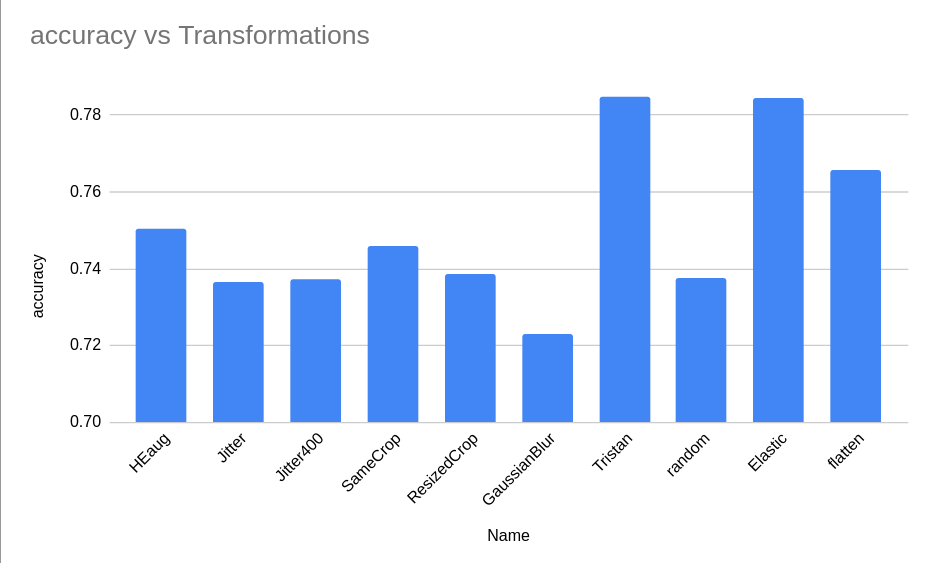

# Utilisation de ce repo

python train.py --datadir /path/to/data/ --pretrained --frozen --model_name resnet50 --epochs 100 --batch_size 256

Le `datadir` doit être comme suit : 

* `/path/to/data/`:
    * `train/`:
        * `label_0/`:
            * `image_0.jpg`
            * `ìmage_1.jpg`
            * ...
        * `label_1/`:
            * `ìmage_0.jpg`
            * ...
        *  ..
    * `val/`:
        * ...
            * ...

Pour plug un autre réseau, le construire à coté, l'ajouter dans le dictionnaire de la méthode `.get_network` avec comme clef 
la valeur rentrée dans l'argument `--model_name`.

# Results of the classification task on PCam

The aim of this work is to optimize a contrastive pretext task for SSL by finding the most relevant transformations to apply to images. The chosen approach is to use momentum contrast ([MoCo](https://github.com/facebookresearch/moco)), a framework developed by Facebook, to train a resnet18 encoder with various image transformations on the TCGA dataset. The learned representations of images have to be both reliable in a wide range of downstream tasks and contain biological meaning. In order to assess the quality of the extracted features, we train a linear classifier on top of them using the benchmark dataset [PatchCamelyon](http://basveeling.nl/posts/pcam/) (PCam).    

Here are the transformations used to train several feature extractors:   


|              | Flips              | GaussianBlur       | Rotate90           | HEaug              | Jitter             | ElasticDistorsion  | DifferentCrops     | CropAndResize      | N°epochs for MoCo  |
|--------------|--------------------|--------------------|--------------------|--------------------|--------------------|--------------------|--------------------|--------------------|--------------------|
| Jitter       | :heavy_check_mark: | :heavy_check_mark: | :heavy_check_mark: | :x:                | :heavy_check_mark: | :x:                | :heavy_check_mark: | :x:                | 200                |
| Jitter400    | :heavy_check_mark: | :heavy_check_mark: | :heavy_check_mark: | :x:                | :heavy_check_mark: | :x:                | :heavy_check_mark: | :x:                | 400                |
| HEaug        | :heavy_check_mark: | :heavy_check_mark: | :heavy_check_mark: | :heavy_check_mark: | :x:                | :x:                | :heavy_check_mark: | :x:                | 200                |
| SameCrop     | :heavy_check_mark: | :heavy_check_mark: | :heavy_check_mark: | :x:                | :heavy_check_mark: | :x:                | :x:                | :x:                | 200                |
| ResizeCrop   | :heavy_check_mark: | :heavy_check_mark: | :heavy_check_mark: | :x:                | :heavy_check_mark: | :x:                | :x:                | :heavy_check_mark: | 200                |
| GaussianBlur | :x:                | :heavy_check_mark: | :x:                | :x:                | :x:                | :x:                | :x:                | :x:                | 200                |
| Tristan      | :heavy_minus_sign: | :heavy_minus_sign: | :heavy_minus_sign: | :heavy_minus_sign: | :heavy_minus_sign: | :heavy_minus_sign: | :heavy_minus_sign: | :heavy_minus_sign: | :heavy_minus_sign: |
| Baseline     | :heavy_minus_sign: | :heavy_minus_sign: | :heavy_minus_sign: | :heavy_minus_sign: | :heavy_minus_sign: | :heavy_minus_sign: | :heavy_minus_sign: | :heavy_minus_sign: | :heavy_minus_sign: |
| Random       | :heavy_minus_sign: | :heavy_minus_sign: | :heavy_minus_sign: | :heavy_minus_sign: | :heavy_minus_sign: | :heavy_minus_sign: | :heavy_minus_sign: | :heavy_minus_sign: | :heavy_minus_sign: |

Further information on feature extractors:
   * Tristan: trained using MoCo on an other dataset using other transformations (to clarify)
   * Baseline: Resnet18 pre-trained on ImageNet
   * Random: Resnet18 with random weights   

## Classifier:   
Once the feature extractor has been trained on the TCGA dataset, the Resnet18 model is fine-tuned on the PCam dataset using the following fully connected layers: 
```  
(fc): Sequential(
    (0): BatchNorm1d(512, eps=1e-05, momentum=0.1, affine=True, track_running_stats=True)
    (1): Linear(in_features=512, out_features=512, bias=True)
    (2): ReLU()
    (3): Linear(in_features=512, out_features=2, bias=True)
  )
```

